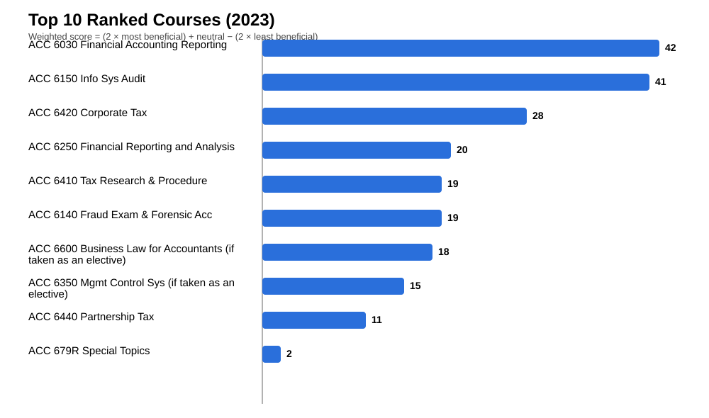

# 2023 Exit Survey Course Ranking

Source sheet: `MAcc Exit Survey - April 2023_O`
Responses analyzed: **55**

Scoring rule: `weighted_score = (2 × most_beneficial) + neutral − (2 × least_beneficial)`

## Top 5 courses

| Rank | Course | Weighted score | Most beneficial | Neutral | Least beneficial | Favorability |
|---:|---|---:|---:|---:|---:|---:|
| 1 | ACC 6030 Financial Accounting Reporting | 42 | 15 | 24 | 6 | 86.7% |
| 2 | ACC 6150 Info Sys Audit | 41 | 21 | 1 | 1 | 95.7% |
| 3 | ACC 6420 Corporate Tax | 28 | 12 | 6 | 1 | 94.7% |
| 4 | ACC 6250 Financial Reporting and Analysis | 20 | 6 | 10 | 1 | 94.1% |
| 5 | ACC 6410 Tax Research & Procedure | 19 | 9 | 3 | 1 | 92.3% |

## Figure

